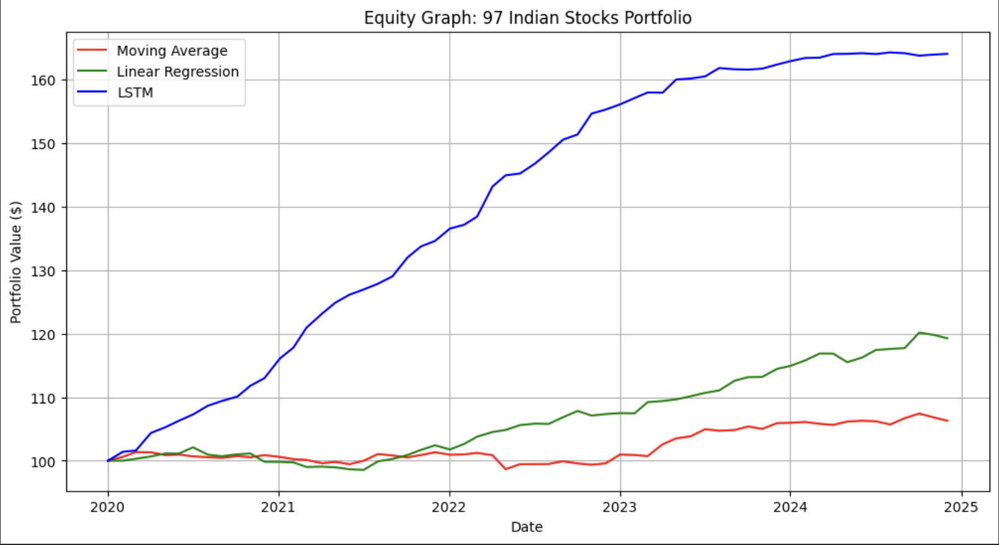

# Predictive Portfolio Optimization using Machine Learning

[](#)
[](#)
[](#)

<div align="center">
  <h3 align="center">Machine Learning in Finance</h3>
  <p align="center">
    Optimizing asset allocation on Indian Equities using predictive modeling.
  </p>
</div>

<details>
  <summary>Table of Contents</summary>
  <ol>
    <li>
      <a href="#about-the-project">About The Project</a>
      <ul>
        <li><a href="#purpose--idea">Purpose & Idea</a></li>
        <li><a href="#dataset">Dataset</a></li>
        <li><a href="#results">Results</a></li>
      </ul>
    </li>
    <li><a href="#built-with">Built With</a></li>
    <li><a href="#methods-used">Methods Used</a></li>
    <li><a href="#getting-started">Getting Started</a></li>
    <li><a href="#usage">Usage</a></li>
    <li><a href="#real-life-applications">Real-Life Applications</a></li>
    <li><a href="#contact">Contact</a></li>
  </ol>
</details>

## About The Project

### Purpose & Idea
Portfolio optimization is the process of allocating funds into financial assets with the goal of maximizing returns over risk. This repository is my attempt at utilizing machine learning methods to create a sparsified and optimized portfolio that will perform well into the future. 

Having predicted the future stock prices using three distinct modeling techniques, I calculate the relevant expected returns. From these, I apply a mathematical optimization technique using a custom Sharpe ratio loss function. This optimizes the returns against the portfolio risk while sparsifying the output weights, expressing the tradeoff between portfolio optimality and simplicity.

### Dataset
The dataset utilized for this project consists of historical daily trading data from the **Nifty 50** and **Nifty Next 50** indices (representing the top ~100 liquid companies in the Indian equity market). 
* **Timeframe:** 10 Years (2015 - 2025)
* **Metrics Included:** Open, High, Low, Close, Adjusted Close, and Volume.

### Results
The models were evaluated over a simulated 5-year investment window using a base starting equity of ₹100. 
* **Moving Average Ending Equity:** ₹106.30
* **Linear Regression Ending Equity:** ₹119.28
* **LSTM Ending Equity:** ₹164.07 (Highest Sharpe Ratio: 0.0667)



The Long Short-Term Memory network significantly outperformed classical statistical models by successfully capturing non-linear temporal dependencies within the Nifty dataset.

## Built With

This section lists the main packages and frameworks used in the project:
* `pandas`
* `numpy`
* `matplotlib.pyplot`
* `seaborn`
* `scikit-learn`
* `keras` (TensorFlow backend)
* `scipy`

## Methods Used

I went about optimizing this portfolio by utilizing three different techniques to forecast stock prices, increasing in complexity:

1. **Moving Average Prediction:** A baseline statistical approach calculating the 252-day rolling mean.
2. **Principal Component Analysis (PCA) + Multiple Linear Regression:** High-dimensional feature data (rolling volatility, z-scores) is compressed using PCA (retaining 95% variance) and fed into a rolling 30-day linear regression window.
3. **Prediction using Recurrent Neural Networks (LSTM):** A deep learning architecture designed to process the PCA-reduced feature matrix and forecast the subsequent 22-day trading horizon.
4. **Optimization:** SciPy minimize function utilizing bounded linear constraints.

## Getting Started

The dataset used in this project is generated locally via the `yfinance` API. The data preprocessing for each model is handled within its respective Python script. 

The suggested order to run the scripts begins with the baseline models, then the deep learning model, and lastly the optimization script.

### Prerequisites
Ensure you have Python installed along with the required libraries.
```bash
pip install pandas numpy matplotlib seaborn scikit-learn tensorflow scipy yfinance
```

# Author
**Akshita Agarwal**
